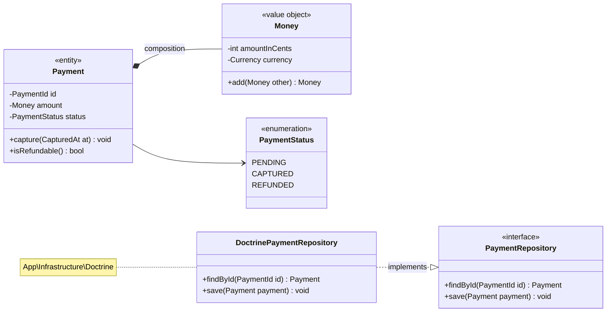
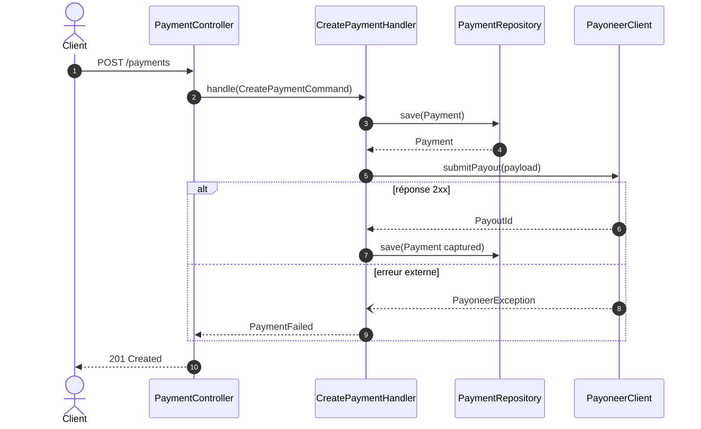
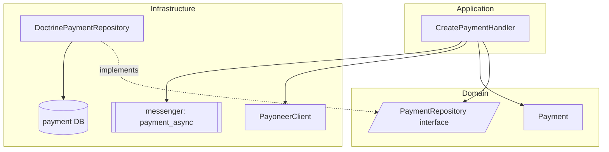
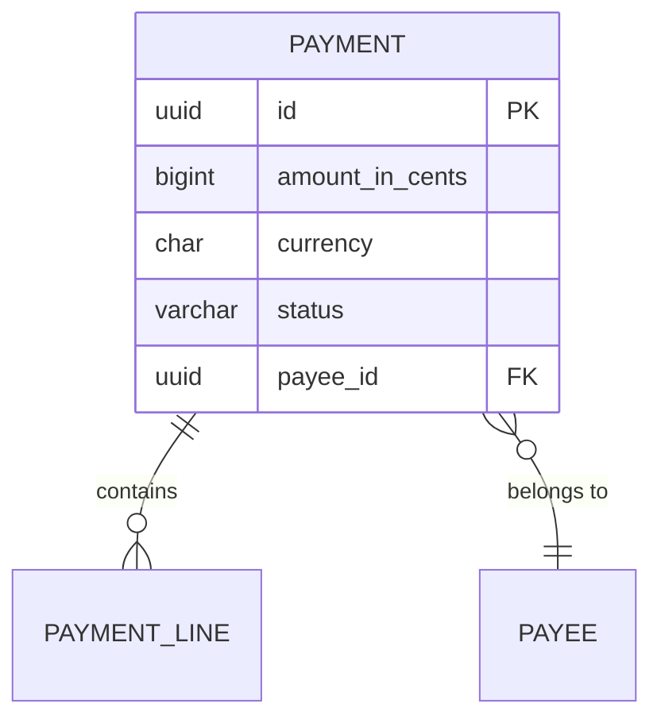
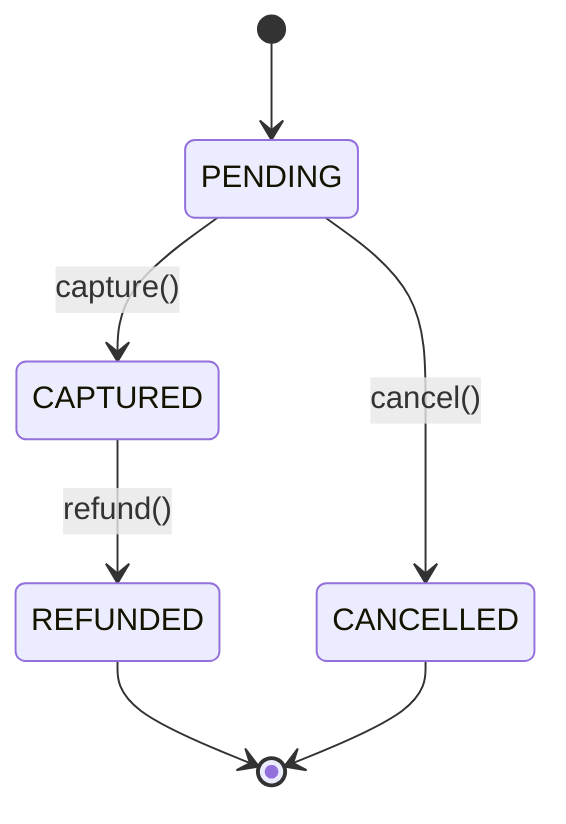
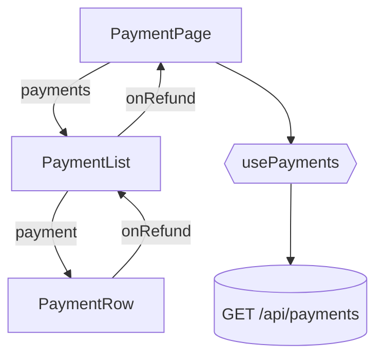

# Mermaid — gabarits UML et pièges

## Pièges de syntaxe (cause n°1 de diagramme cassé)

- Pas de `<` `>` `(` `)` bruts dans un label de nœud `flowchart` : les entourer de guillemets — `A["Handler (sync)"]`.
- `classDiagram` : les génériques s'écrivent `List~Payment~`, jamais `List<Payment>`.
- Un nom de classe ne peut pas contenir `\`. Utiliser le nom court + note pour le namespace.
- `sequenceDiagram` : `participant P as Nom Lisible` puis toujours référencer `P`.
- Les commentaires Mermaid commencent par `%%` en début de ligne.
- Un `note for X` en `classDiagram` doit suivre la déclaration de `X`.

## Class diagram

Relations : `<|--` héritage, `..|>` implémentation, `*--` composition, `o--` agrégation, `-->` association dirigée, `..>` dépendance (à réserver aux liens déduits, annotés).

## Sequence diagram

`->>` appel sync, `-->>` retour, `--)` async/événement, `activate`/`deactivate` uniquement si la durée de vie apporte une information.

## Component diagram

Formes : `[(...)]` base de données, `[[...]]` file/bus, `[/.../]` interface, `((...))` acteur externe.

## ERD

Cardinalités : `||` exactement un, `o{` zéro ou plusieurs, `|{` un ou plusieurs.

## State diagram

Nommer les transitions avec la méthode ou la transition Symfony Workflow réelle, pas une paraphrase.

## React (pas de classDiagram)

Flèche descendante = props, flèche remontante = callback, `{{...}}` = hook.
